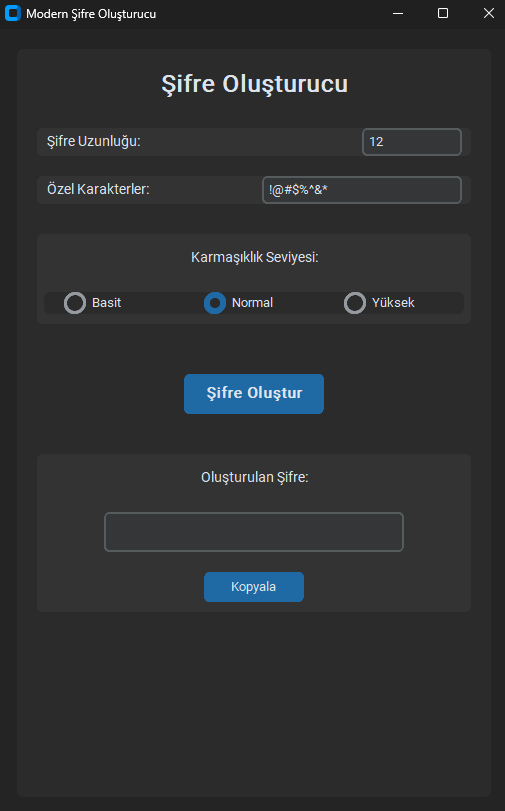

# Modern Şifre Oluşturucu (Modern Password Generator)

Modern ve kullanıcı dostu bir arayüze sahip, özelleştirilebilir şifre oluşturma uygulaması.



## Özellikler

- 🎨 Modern ve şık kullanıcı arayüzü (CustomTkinter)
- 🌓 Koyu tema desteği
- 🔐 Üç farklı karmaşıklık seviyesi:
  - Basit: Küçük harfler ve rakamlar
  - Normal: Küçük harfler, büyük harfler ve rakamlar
  - Yüksek: Küçük harfler, büyük harfler, rakamlar ve özel karakterler
- ✏️ Özelleştirilebilir şifre uzunluğu
- 🔧 Özelleştirilebilir özel karakterler
- 📋 Tek tıkla kopyalama özelliği

## Kurulum

1. Python'u bilgisayarınıza yükleyin (Python 3.x)
2. Gerekli kütüphaneleri yükleyin:
```bash
pip install -r requirements.txt
```

## Kullanım

1. Uygulamayı başlatın:
```bash
python password_generator.py
```

2. Şifre uzunluğunu belirleyin (varsayılan: 12)
3. İsterseniz özel karakterleri özelleştirin (varsayılan: !@#$%^&*)
4. Karmaşıklık seviyesini seçin:
   - Basit: Günlük kullanım için basit şifreler
   - Normal: Genel kullanım için dengeli şifreler
   - Yüksek: Maksimum güvenlik için karmaşık şifreler
5. "Şifre Oluştur" butonuna tıklayın
6. Oluşturulan şifreyi kopyalamak için "Kopyala" butonunu kullanın

## Güvenlik Özellikleri

- Her karmaşıklık seviyesi için minimum karakter gereksinimleri
- Rastgele karakter sıralaması
- Seçilen karmaşıklık seviyesine göre garantili karakter çeşitliliği

## Gereksinimler

- Python 3.x
- CustomTkinter

## Geliştirici Notları

### Kod Yapısı

- `PasswordGenerator` sınıfı: Ana uygulama mantığı
- Modern GUI tasarımı için CustomTkinter kullanımı
- Temiz ve modüler kod yapısı

### Katkıda Bulunma

1. Bu depoyu fork edin
2. Yeni bir branch oluşturun (`git checkout -b yeni-ozellik`)
3. Değişikliklerinizi commit edin (`git commit -am 'Yeni özellik eklendi'`)
4. Branch'inizi push edin (`git push origin yeni-ozellik`)
5. Pull Request oluşturun

## Lisans

Bu proje MIT lisansı altında lisanslanmıştır. Daha fazla bilgi için `LICENSE` dosyasına bakın.

## İletişim

Sorularınız veya önerileriniz için bir Issue açabilirsiniz.

---

Made with ❤️ in Turkey